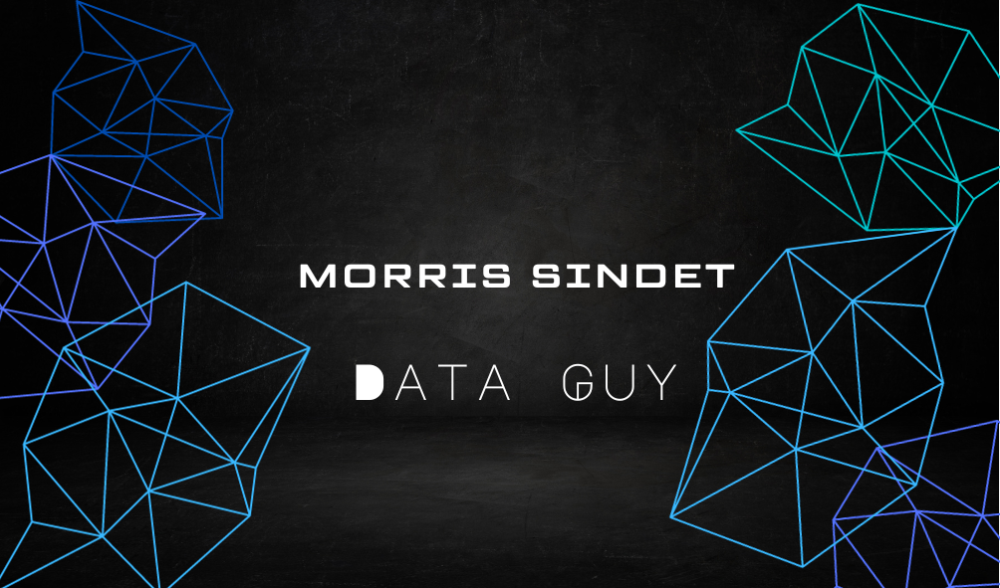

  

---

<h3 align="center">Im an aspiring Data analyst/Data Engineer currently learning Python,SQL,PowerBi,Java,Machine Learning</h3>

  

 
- 🔭 I’m currently working on **Personal Portfolio Projects**

- 🌱 I’m currently learning **Python,SQL,Hadoop,Scala,Power Bi,Tableau,Streamlit,**

- 👯 I’m looking to collaborate on **Data science & Data analyst projects**

- 🤝 I’m looking for help with **mentorship**

- 📝 I regularly write articles on [Medium](https://medium.com/@morrisindet) and [DEV.TO](https://dev.to/sindet_)

- 💬 Ask me about **SQL,Streamlit,Power Bi ,Tableau,Big Data**

- 📫 How to reach me **morrisindet@gmail.com**

---

## 📝 Top Blog Posts
  
<!-- BLOG-POST-LIST:START -->
-   [Python EDA Techniques ](https://medium.com/@morrisindet/10-mind-blowing-data-insights-unlocked-by-pythons-eda-techniques-a018858eb505)
-   [Beginner Guide to SQL ](https://medium.com/@morrisindet/unlock-your-data-a-beginners-guide-to-sql-for-data-analysis-f4b06201da)

<!-- BLOG-POST-LIST:END -->

---

  

---

                    

---

  

>

